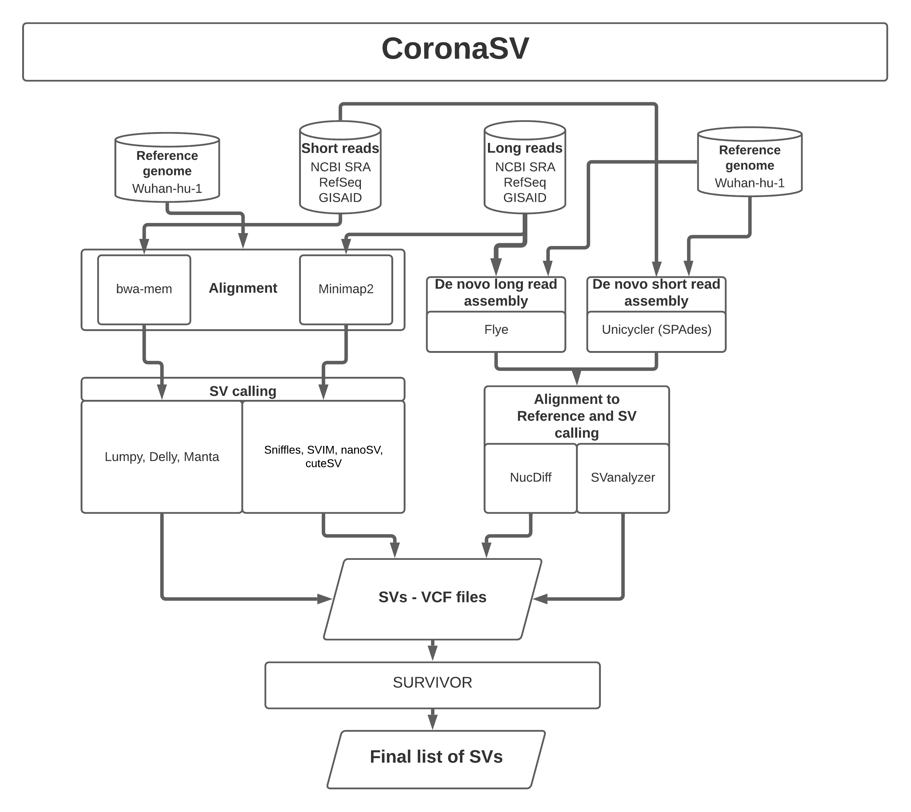

# CoronaSV

*Hackathon team: Daniel Agustinho, Daniela Soto, Max Marin, Shangzhe Zhang, Todd Treangen, Yunxi Liu*

## Awesome Logo


## Website (if applicable)

## Intro statement

CoronaSV is an SV detection and validation pipeline for SARS-CoV-2 samples.

## What's the problem?

Deletions have been reported in several SARS-CoV-2 genomes, primarily detected at the consensus/assembly level. Existing methods of detecting structural variation at read level often suffer from false positive calls, and sample analysis with different SV calling pipelines would result in inconsistent calls. However, accurate and trustable SV calls at read level are required for SARS-CoV-2 downstream analysis. 

## Why should we solve it?

Understanding structure variations in SARS-CoV-2 genomes is critical for us to learn the biological mechanism of SARS-CoV-2. By combining geographical data, SV information can serve as evidence for transmissions. Such mutations can also affect the effectiveness of COVID diagnosis and treatment. Therefore, a tool that can accurately detect SVs for SARS-CoV-2 at read level is needed. 

# What is <this software>?

CoronaSV is a pipeline for structural variation detection and validation for SARS-CoV-2 at read level. CoronaSV takes both short and long read datasets as input, followed by the quality control step that does quality trimming and engineering sequence removal. CoronaSV incorporates both reference guided and de novo assembly approaches, and makes high confident SV calls by combining results from multiple state of the art SV callers using SURVIVOR.

# Overview Diagram



# CoronaSV Pipeline Overview

## Data download

All sequencing read data will be queried and downloaded from SRA using the SRAtoolkit. 

## SV calling from de novo assemblies

A) Assembly Software

A.1) [UniCycler](https://github.com/rrwick/Unicycler) 

Description: UniCycler will be used to assemble Illumina (short read) data into consensus genome sequence. UniCycler uses the SPAdes assembler internally with additional optimization steps.

A.2) [Flye](https://github.com/fenderglass/Flye)

Description: Flye will be used to assembly Nanopore (long read) data into a consensus genome sequence.

B) Structural Variant Calling (Assembly alignment to reference)

B.1) [NucDiff](https://github.com/uio-cels/NucDiff)

NucDiff will perform alignment of all assemblies to the reference genome, and detect SV based on this assembly to reference alignment.

B.2) [SVanalyzer - SVrefine](https://github.com/nhansen/SVanalyzer)

The SVdefine pipeline of the SVanalyzer package will be used to call and describe SVs relative to the reference using the NUCmer alignments generated by NucDiff as input.

## SV calling from short-reads

A) Filtering

A.1) [Trim Galore](http://www.bioinformatics.babraham.ac.uk/projects/trim_galore/) was used to remove adapters and low-quality bases from short-reads. 

A.2) After mapping, PCR duplicates were removed using [Picard MarkDuplicates](https://github.com/broadinstitute/picard)

B) Mapping

Short-reads were mapped to SARS-CoV-2 reference using [bwa mem](https://github.com/lh3/bwa).

C) SV calling from short-reads

C.1) [Manta](https://github.com/Illumina/manta)

Manta identifies deletions, duplications, inversions or translocations in paired-end short-read sequencing using paired-end and split-read mapping information.

C.2) [Delly](https://github.com/dellytools/delly)

Delly uses a combination of paired-ends, split-reads and read-depth signatures to detect deletions, tandem duplications and translocations at single-nucleotide resolution.

C.3) [Lumpy](https://github.com/arq5x/lumpy-sv)

Lumpy integrates multiple SV signals (read-pair, split-read, read-depth) to identify deletions, tandem duplications, inversions and translocations in short-read sequencing. 

## SV calling from long-reads

A) Filtering

A.1) [NanoPlot](https://github.com/wdecoster/NanoPlot) was used to plot the quality of long-read sequences.

A.2) [Nanofilt](https://github.com/wdecoster/nanofilt) was used to filter long reads on quality and/or read length, and optional trim after passing filters.

B) Mapping

Long-reads was mapped to reference genome by SARS-CoV-2 reference by (minimap2)[https://github.com/lh3/minimap2]

C) SV calling for long-reads

C.1) [Sniffles](https://github.com/fritzsedlazeck/Sniffles)

Sniffles detects all types of SVs (10bp+) using evidence from split-read alignments, high-mismatch regions, and coverage analysis.

C.2) [SVIM](https://github.com/eldariont/svim)

SVIM is able to detect, classify and genotype five different classes of structural variants.  SVIM works better on integrating information from across the genome to precisely distinguish similar events, such as tandem and interspersed duplications and simple insertions.

C.3) [nanoSV](https://github.com/mroosmalen/nanosv)

NanoSV identifies split- and gapped-aligned reads and clusters the reads according to the orientations and genomic positions of the read segments to define breakpoint-junctions of structural variations.

C.4) [cuteSV](https://github.com/tjiangHIT/cuteSV) 

cuteSV uses tailored methods to collect the signatures of various types of SVs and employs a clustering-and-refinement method to analyze the signatures to implement sensitive SV detection.

## SV datasets integration

[SURVIVOR](https://github.com/fritzsedlazeck/SURVIVOR) is a tool set for simulating/evaluating SVs, merging and comparing SVs within and among samples, and includes various methods to reformat or summarize SVs. 

SV callsets were compared and integrated using it.

# File structure diagram 
#### _Define paths, variable names, etc_

# Installation options:

We provide two options for installing <this software>: Docker or directly from Github.

### Docker

The Docker image contains <this software> as well as a webserver and FTP server in case you want to deploy the FTP server. It does also contain a web server for testing the <this software> main website (but should only be used for debug purposes).

1. `docker pull ncbihackathons/<this software>` command to pull the image from the DockerHub
2. `docker run ncbihackathons/<this software>` Run the docker image from the master shell script
3. Edit the configuration files as below

### Installing <this software> from Github

1. `git clone https://github.com/NCBI-Hackathons/<this software>.git`
2. Edit the configuration files as below
3. `sh server/<this software>.sh` to test
4. Add cron job as required (to execute <this software>.sh script)

### Configuration

```Examples here```

# Testing

We tested four different tools with <this software>. They can be found in [server/tools/](server/tools/) . 

# Additional Functionality

### DockerFile

<this software> comes with a Dockerfile which can be used to build the Docker image.

  1. `git clone https://github.com/NCBI-Hackathons/<this software>.git`
  2. `cd server`
  3. `docker build --rm -t <this software>/<this software> .`
  4. `docker run -t -i <this software>/<this software>`
  
### Website

There is also a Docker image for hosting the main website. This should only be used for debug purposes.

  1. `git clone https://github.com/NCBI-Hackathons/<this software>.git`
  2. `cd Website`
  3. `docker build --rm -t <this software>/website .`
  4. `docker run -t -i <this software>/website`
  


