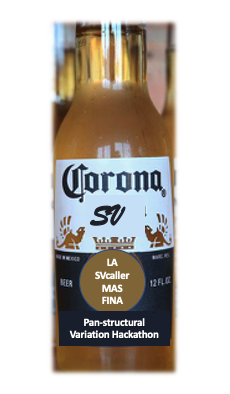

# CoronaSV


*Hackathon team: Daniel Agustinho, Daniela Soto, Max Marin, Shangzhe Zhang, Todd Treangen, Yunxi Liu, Arda Soylev*

## Final Presentation

[Awesome Final Presentation](https://docs.google.com/presentation/d/1d9g-2LXWCSygzYGksg4ICuro8Ghy0tMR4VkOIaBDs9w/edit?usp=sharing)

## What's the problem?

Deletions have been reported in several SARS-CoV-2 genomes, primarily detected at the consensus/assembly level. The level of confidence in how these deletions are detected have not yet thoroughly been evaluated.  Existing methods for detecting structural variation at the individual read level often suffer from false positive calls. Additionally analysis with different SV calling pipelines often result in inconsistent calls. In order to examine the landscape and extent of structural variation across SARS-Cov-2 genomes, a method for generating accurate and trustworthy SV calls is needed. With this in mind, we developed the CoronaSV bioinformatics pipeline.

CoronaSV is a structural variation detection and validation pipeline for SARS-CoV-2 that combines an ensemble of structural variant calling approaches using both long read and short read sequencing technologies. Both assembly based and read based structural variant detection detection methods are used by CoronaSV. By combining different sequencing technologies and variant detection approaches, we can identify both a) confident SV calls and b) artifacts that may result from specific technologies + computational approaches.


## What is CoronaSV?
CoronaSV is an SV detection and validation pipeline for SARS-CoV-2 sequencing data (Illumina Paired-End & Oxford Nanopore Long Read Sequencing).
CoronaSV takes both short and long read datasets as input, followed by the quality control step that does quality trimming and engineering sequence removal. CoronaSV incorporates both reference guided and de novo assembly approaches, and makes high confident SV calls by combining results from multiple state of the art SV callers using [SURVIVOR](https://github.com/fritzsedlazeck/SURVIVOR).


## Installation of CoronaSV

All of the software packages used by CoronaSV can be installed via the Conda package manager. Additionally, the CoronaSV workflow is defined using Snakemake. Running the CoronaSV.smk snakemake pipeline handles downloading all specified data and processing of sequencing data to variant calls.


### Installing CoronaSV from Github (Using [conda](https://github.com/conda/conda))

Clone the CoronaSV Github repository, and then use conda to create an environment with all needed software. This Conda environment includes all of the core software used by the pipeline + the Snakemake workflow management system.

```
# Clone Git Repo
git clone https://github.com/collaborativebioinformatics/coronasv.git

cd ./coronasv/

# Create an environment for CoronaSV
conda env create -f ./Envs/CoronaSV_V1.yml  -n CoronaSV

# Activate CoronaSV environment
conda activate CoronaSV

```

That's it! You should now have the CoronaSV environment activated.


### A quick example of how to run CoronaSV (Using [SnakeMake](https://snakemake.github.io/))

The example below runs CoronaSV on all SRA Run Accessions defined in the 'Metadata_TSV' file.

In this case the Metadata TSV is defined as ['./runInfo_TSVs/CoronaSV_metadata_TestSubset_1_Nanopore_1_Illumina.tsv'](runInfo_TSVs/CoronaSV_metadata_TestSubset_1_Nanopore_1_Illumina.tsv'), which contains 1 Nanopore sequencing run and 1 Illumina sequencing run of a SARS-Cov-2 isolate.

```
conda activate CoronaSV

# Enter "coronasv" git repository directory
cd ./coronasv/

# Define configuration files
input_ConfigFile="./SMK_config_V1.txt"

input_SampleInfo_TSV="./Metadata_TSVs/CoronaSV_metadata_TestSubset_1_Nanopore_1_Illumina.tsv"


# DEFINE the output directory of the CoronaSV pipeline

target_Output_Dir="../CoronaSV_Analysis_TestSubset1_OutputDir"

mkdir ${target_Output_Dir}

# Run 
snakemake -s CoronaSV_V1.smk --config output_dir=${target_Output_Dir} inputSampleData_TSV=${input_SampleInfo_TSV} --configfile ${input_ConfigFile} -p --use-conda --cores 4 
``` 

If you would like to run CoronaSV on all samples identified in our metadata file, change the definition of the 'input_SampleInfo_TSV' bash variaible:

```
input_SampleInfo_TSV="./Metadata_TSVs/CoronaSV_metadata_TestSubset_1_Nanopore_1_Illumina.tsv"
```

## Overview of available data

Sequencing data from multiple sequencing technologies and library prep strategies are available. A summary of out initial dataset can be found in: [201013_CoronaSV_Metadata_V1.tsv](Metadata_TSVs/201013_CoronaSV_Metadata_V1.tsv).


# CoronaSV Pipeline Overview


## Data download

All sequencing read data is queried and downloaded from SRA using the SRAtoolkit. 

## SV calling from short-reads

A) Filtering

A.1) [trimmomatic](http://www.usadellab.org/cms/index.php?page=trimmomatic) was used to remove adapters and low-quality bases from short-reads. 

A.2) After mapping, PCR duplicates were removed using [Picard MarkDuplicates](https://github.com/broadinstitute/picard)

B) Mapping

Short-reads were mapped to SARS-CoV-2 reference using [bwa mem](https://github.com/lh3/bwa).

C) SV calling from short-reads

C.1) [Manta](https://github.com/Illumina/manta)

Manta identifies deletions, duplications, inversions or translocations in paired-end short-read sequencing using paired-end and split-read mapping information.

C.2) [Delly](https://github.com/dellytools/delly)

Delly uses a combination of paired-ends, split-reads and read-depth signatures to detect deletions, tandem duplications and translocations at single-nucleotide resolution.

C.3) [Lumpy](https://github.com/arq5x/lumpy-sv)

Lumpy integrates multiple SV signals (read-pair, split-read, read-depth) to identify deletions, tandem duplications, inversions and translocations in short-read sequencing. 

C.4) [Tardis](https://github.com/BilkentCompGen/tardis)

Tardis uses multiple SV signatures such as read-pair, read-depth and split-read to discover various SV types using paired-end Illumina data. These include deletions, inversions, MEIs, tandem and interspersed duplications in forward and reverse orientations. 


## SV calling from de novo assemblies

A) Assembly Software

A.1) [UniCycler](https://github.com/rrwick/Unicycler) 

Description: UniCycler will be used to assemble Illumina (short read) data into consensus genome sequence. UniCycler uses the SPAdes assembler internally with additional optimization steps.

B) Structural Variant Calling (Assembly alignment to reference)

B.1) [NucDiff](https://github.com/uio-cels/NucDiff)

NucDiff will perform alignment of all assemblies to the reference genome, and detect SV based on this assembly to reference alignment.

B.2) [SVanalyzer - SVrefine](https://github.com/nhansen/SVanalyzer)

The SVdefine pipeline of the SVanalyzer package will be used to call and describe SVs relative to the reference using the NUCmer alignments generated by NucDiff as input.

B.3) [Minimap2](https://github.com/lh3/minimap2)
Minimap2 was used to align the completed short read assemblies to the reference genome. The paftools utility of minimap2 was used to produce variant calls in VCF format after alignment.


## SV calling from long-reads

A) Filtering

A.1) [NanoPlot](https://github.com/wdecoster/NanoPlot) was used to plot the quality of long-read sequences.

A.2) [Nanofilt](https://github.com/wdecoster/nanofilt) was used to filter long reads on quality and/or read length, and optional trim after passing filters.

B) Mapping

Long-reads was mapped to reference genome by SARS-CoV-2 reference by [minimap2](https://github.com/lh3/minimap2)

C) SV calling for long-reads

C.1) [Sniffles](https://github.com/fritzsedlazeck/Sniffles)

Sniffles detects all types of SVs (10bp+) using evidence from split-read alignments, high-mismatch regions, and coverage analysis.

C.2) [SVIM](https://github.com/eldariont/svim)

SVIM is able to detect, classify and genotype five different classes of structural variants.  SVIM works better on integrating information from across the genome to precisely distinguish similar events, such as tandem and interspersed duplications and simple insertions.

C.3) [nanoSV](https://github.com/mroosmalen/nanosv)

NanoSV identifies split- and gapped-aligned reads and clusters the reads according to the orientations and genomic positions of the read segments to define breakpoint-junctions of structural variations.

C.4) [cuteSV](https://github.com/tjiangHIT/cuteSV) 

cuteSV uses tailored methods to collect the signatures of various types of SVs and employs a clustering-and-refinement method to analyze the signatures to implement sensitive SV detection.

## SV datasets integration

[SURVIVOR](https://github.com/fritzsedlazeck/SURVIVOR) is a tool set for simulating/evaluating SVs, merging and comparing SVs within and among samples, and includes various methods to reformat or summarize SVs. 

SV callsets were compared and integrated using [SURVIVOR](https://github.com/fritzsedlazeck/SURVIVOR).


## Results 

### SV distribution of long-read data


### SV distribution of shor-read data


